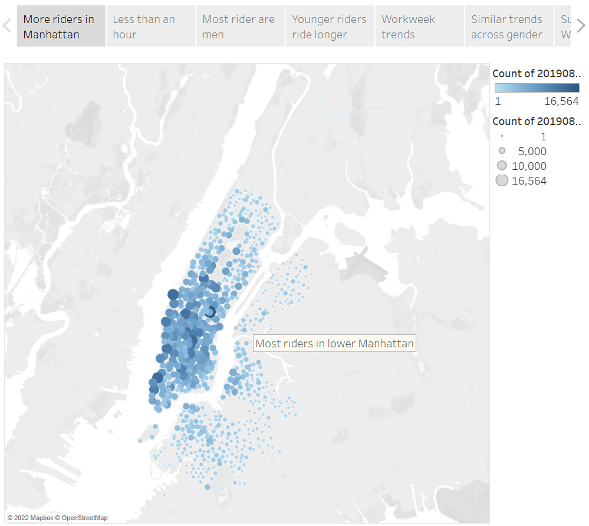
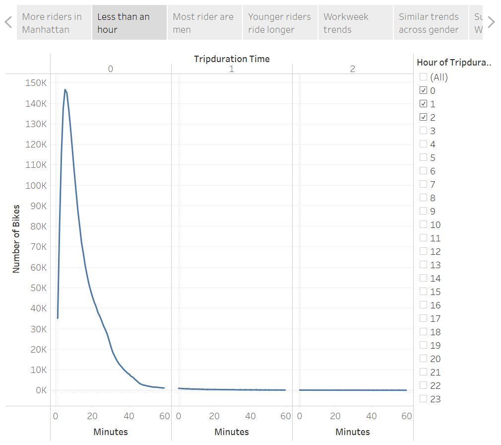
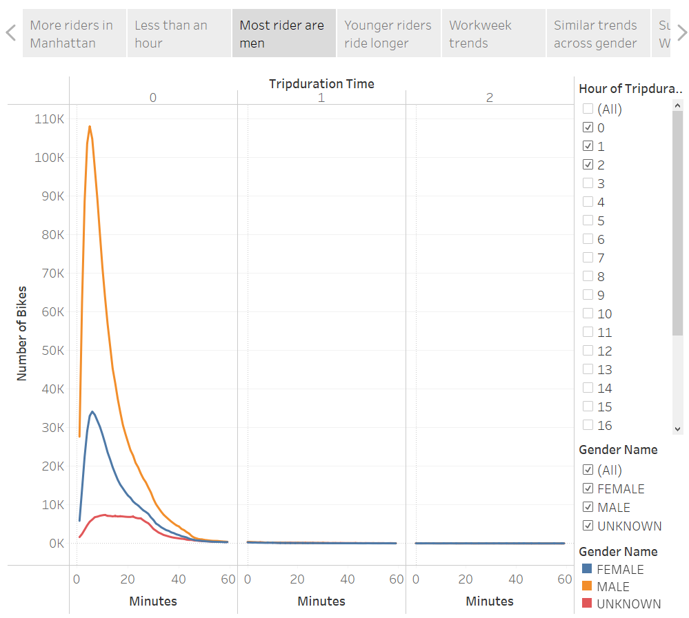
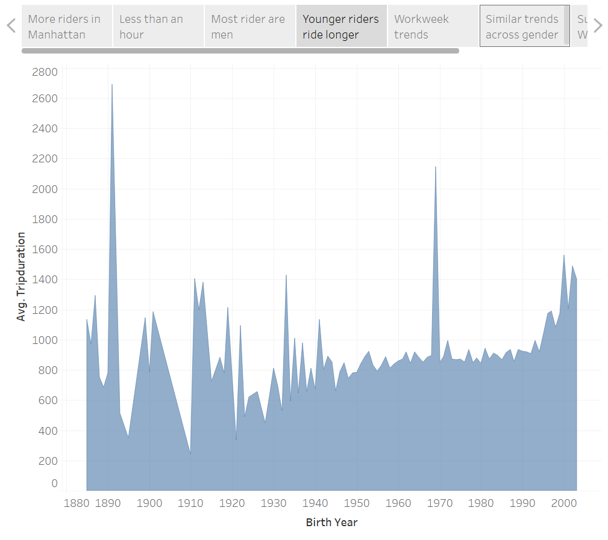
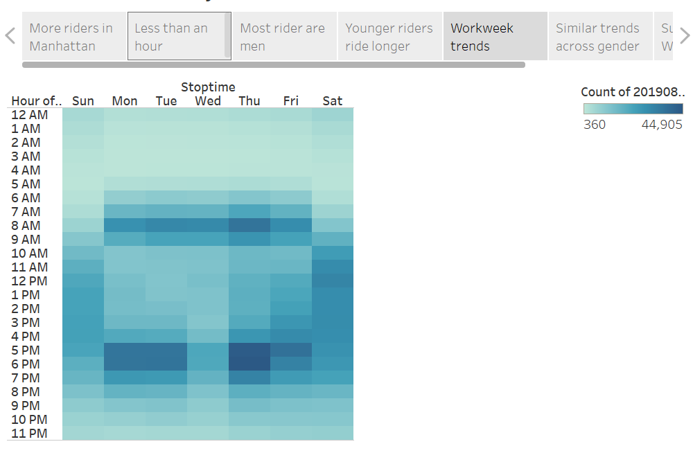
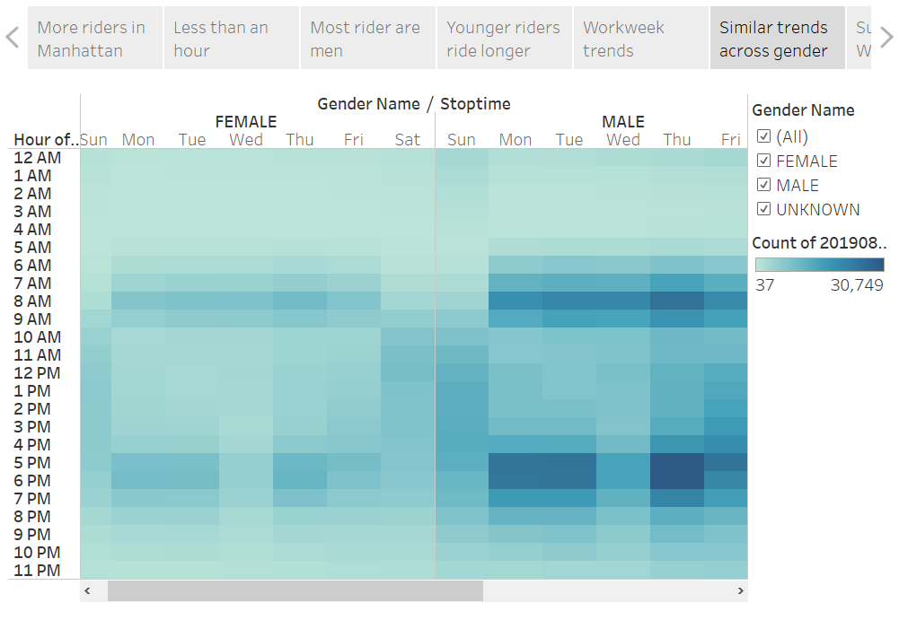
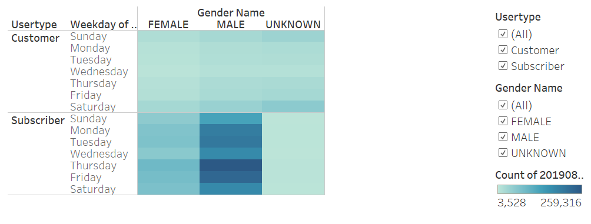
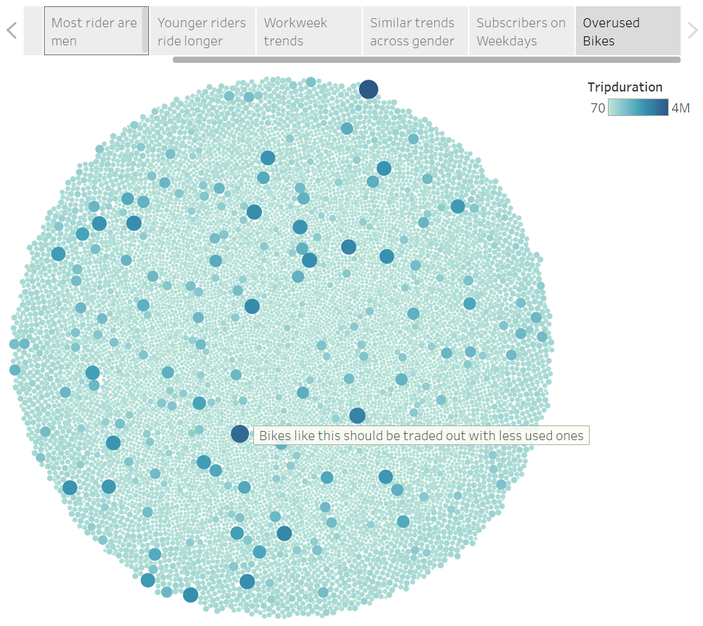

# Bike Sharing with Tableau

[NYC Citibike Dashboard](https://public.tableau.com/views/NYCCitibike08-2019/NYCCitibikeStory?:language=en-US&:display_count=n&:origin=viz_share_link "NYC Citibike Dashboard")

## Overview of the analysis - Purpose

We would like to set up a bike-sharing business in Des Moines, Iowa. First, we need to convince investors why we believe this is a good business proposal. To do this we will analyze New York City bikesharing data to see what trends and patterns exist, and whether or not they bode well for our plan. After creating eight different worksheet visualizations, we'll combine them together in our final Tableau story. 

## Results

Starting with the first visualization, in the image below, the majority of riders are in Manhattan, specifically lower Manhattan. Additionally, the bikes in the Bronx area have very few riders. Therefore, the majority of riders are in the downtown highly populated areas of the city. 

The overwhelming majority of riders have a trip duration of less than an hour, with the majority of that being less than 30 minutes. The peak trip duration is 5 minutes, so most rides are quick. 

When split by gender we can see that most riders are male. Both the male and female riders have a roughly similar distribution of trip duration. The unknown gender category has the least rides, and interestingly enough has a more flat curve for some reason. 

Average trip duration across birth year seems to slowly increase from 1940 to 1990 and then greatly increase from there. This signifies that younger riders ride the bikes further on average. The data is a bit anomalous before the 1940s, and oddly for one year before 1970. 

On the weekdays the most popular times to ride are in the morning from 6 to 10am, and the evening from 4 to 9pm. This likely corresponds with people going to and coming from work, though Wednesday for some reason has less riders. On the weekends there is a slow ramp up to peak hours around 11am to 5pm, and then ramp back down into the night.

These trends seem to hold across gender, meaning that everyone uses the bikes in roughly similar ways on average. 

Subscribers seem to use the bikes more during the weekdays, whereas customers use them more on the weekends. This makes sense seeing as subscribers are likely people who use the bikes to get around the city during work, whereas customers are likely using it more for a weekend activity. 

Finally, we can see that some bikes are used much more highly than others, likely because they are in high traffic areas. These bikes should be swapped out with less used ones periodically to help reduce overall wear and tear. 

## Summary
